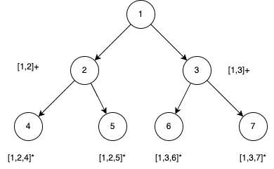
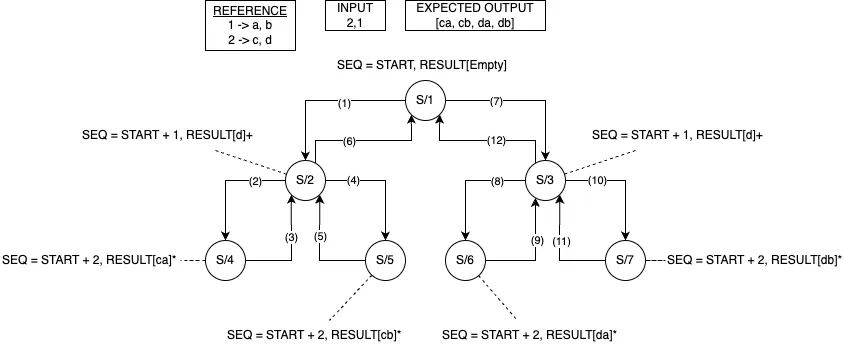
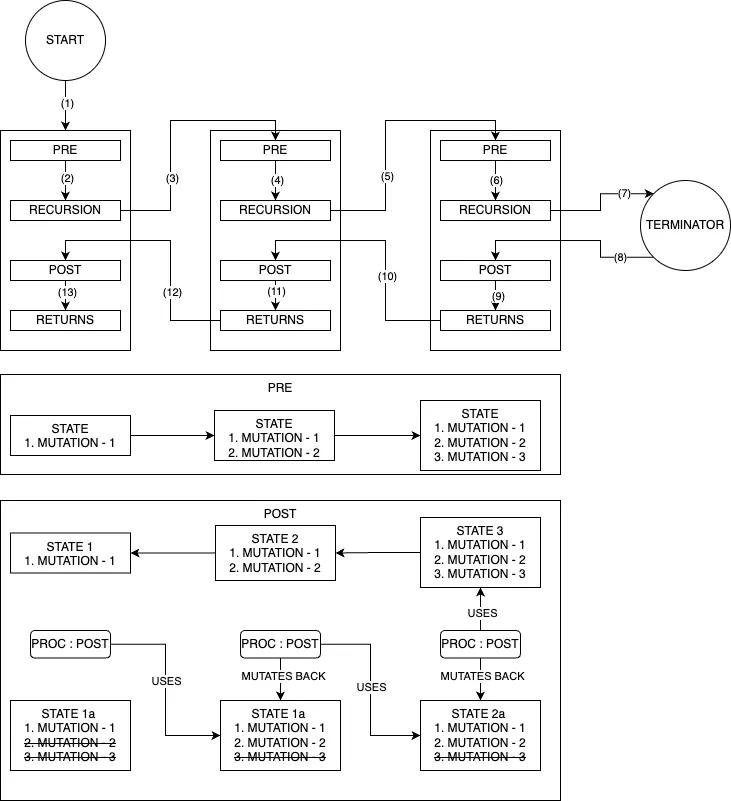

import { Card, CardGrid, TwoColumnContent } from '@astrojs/starlight/components';

## Preamble
Given a sequence of digits from 0-9 inclusive, return all possible letter combinations that the number could represent. Return the answer in any order.
<CardGrid>
	<Card title="Phone Digit to Letters Mapping">
		| DIGIT 	| LETTERS 	| DIGIT 	| LETTERS 	|
		| ---------	| --------	| ---------	| ---------	|
		| 0 &rarr;	| 0		  	|  1 &rarr; | 1			|
		| 2 &rarr;	| a, b, c	|  3 &rarr;	| d, e, f	|
		| 4 &rarr;	| g, h, i	|  5 &rarr;	| j, k, l	|
		| 6 &rarr;	| m, n, o	|  7 &rarr;	| p, q, r, s|
		| 8 &rarr;	| t, u, v	|  9 &rarr;	| w, x, y, z|
		
		0 and 1 map to themselves.
	</Card>
	<Card title="Brief explanation of the problem">
		We see something like this `1-800-ASK-STAR` phone number listed by advertisers. ASK represents `2 7 5`. `2 7 5` can be translated to letter combinations, that would provide us more options than just `ASK`.
		APJ, APK, APL, AQJ, AQK, AQL, ARJ, ARK, ARL, ASJ, ASK, ASL
		BPJ, BPK, BPL, BQJ, BQK, BQL, BRJ, BRK, BRL, BSJ, BSK, BSL
		CPJ, CPK, CPL, CQJ, CQK, CQL, CRJ, CRK, CRL, CSJ, CSK, CSL.
		
		`2 7 5` can be represented by any of the above letter combinations, just like `ASK`.
		
		The algorithm should efficiently find the possible letter combination for a phone number which is a sequence of digits.
	</Card>
	
</CardGrid>

### Intuition towards solving the problem: 
Let's take the example `2-7-5`, `2` maps to `a, b, c`. If we think about a function that expands the digits to produce letter combination, the function may look like this:
```
expand(2,7,5):
	-- first level of expansion by expanding `2`
	[{a + expand(7,5)}, {b + expand(7,5)}, {c + expand(7,5)}]
	-- second level of expansion by expanding 7
	[{ap + expand(5), aq + expand(5), ar + expand(5), as + expand(5)}, {...}, {...}]
	-- Third level of expansion by expanding 5
	[{apj, apk, apl, --- aqj, aqk, aql, --- arj, ark, arl, --- asj, ask, asl}, {...}, {...}]
```

We can see a pattern emerging, that is, we are building a tree and every leaf brings us a result of the final output or resultset. A leaf has its value and all its transitive parents' values. All the children of a parent (root or non-root) share the partial result the parent has. Lets look at the below picture to make some sense. The picture does not use input `2 7 5` as the example but an abstract form of recursive expansion.



Every node indicates the value it acquired, all values are notional. The acquired value is enclosed by square brackets `[value]`. A `+` sign indicates the value is not final yet, whereas a `*` indicates the final value. 

Nodes (4), (5), (6), (7) are the leaf nodes, so we have 4 results in the output resultset. Node (4) holds the result [1,2,4], node (5) holds [1,2,5] node (6) holds [1,3,6] and node (7) holds [1,3,7]. (4) and (5) have a shared parent (2). (2) holds a value [1,2] which is shared by both of its children.


From the identified parent we know that our resultset will have partial overlaps in results. Since that's what it is expected we take that has constraint on us, but what about the internal data structure? We can either use cloning of partial results and provide that to each branch of execution, this will work at the expense of huge additional memory requirements. Notional (not real yet) space complexity for this particular part is O(l X l), where l is the number of leaves. The number of leaves will be `power(branching factor, height of the tree)`. So no, what can we do better? Since all the children of a same parent inherits the same prefix from the parent, can we reuse the prefix? What about when we reach to a leaf node record (by serializing) the result into resultset and then delete the child's contributed value? That sounds like a workable better solution. That is `backtracking`. 

### Main Algorithm 
Let's look at the algorithm with backtracking. 

```
output : = List[List[Char]]
expand(digits : Seq[Int], idx : Int, result) is
	if idx IS_EQUAL_TO lengthOf(digits):
		output -> add(result)
	else:
		-- get the key of the map which is the value at current index of digits
		key := digits[idx]
		-- get the corresponding list of letters for the key 
		letters := map -> get(key)
		-- iterate over the letters 
		for (Char letter : letters):
			-- add the character to the accumulating result 
			result -> add(letter)
			-- pass the modified result along with next index
			expand(digits, idx + 1, result)
			-- backtrack so that another series of expansions can happen 
			result -> remove(letter)

```
`output` has all the letter combinations. That's a complete algorithm. This is a trivial looking non-trivial algorithm and this pattern can be used in many places, so lets dive deeper in understanding how backtracking solved this problem and how backtracking indeed works. 

### Backtracking Explanation 


Follow the steps of the above diagram, the sequence of execution is (1) &rarr; (2) &rarr; (3) &rarr; (4) &rarr; (5) &rarr; (6) &rarr; (7) &rarr; (8) &rarr; (9) &rarr; (10) &rarr; (11) &rarr; (12).

`S/1, S/2, S/3, S/4, S/5, S/6, S/7` are the States. The State numbering does not have any implied logic in it, just take it as some identifiers. If we look at the above diagram again, step (2) brings the state from S/2 to S/4. Since S/4 is a terminal state, we record the result by serializing it. Step (3) brings the state back to S/2, state translation happens from State S/4 back to State S/2. Likewise, steps (3), (5), (9), (11), (6), and (12) each brings the state back, each undoes the state change in the previous step. And that's backtracking. Let's see a simplified more abstract algorithm for it below.

### Abstract logic 

```
Function (KEY_SEQ, SEQ_NUM, RESULT_BUILDER)
	|  -- Check for the termination, did we exhaust the input?
	|  IF SEQ_NUM IS OUTSIDE THE UPPER_BOUND:
	|  	RETURN -- return to it's caller 
	|  Key := KEY_SEQ -> Get (SEQ_NUM)
	|  List[VALUE] := REFERENCE -> Get(KEY)
	|  For Each VALUE in List[VALUE]:
		|  -- Go to the next level of the branch 
		|  Function(KEY_SEQ,  Next(SEQ_NUM), RESULT_BUILDER -> Add(VALUE)
		| -- Only when above function finishes it does clean up
		|  RESULT_BUILDER -> Remove(VALUE)
```
But let's not stop here, there is an idiomatic problem in the above description diagram where we said state transitions back to previous state, practically that can be treated as correct but it is not, the states are EQUAIVALENT but not EQUAL. Let's explore what really happens in the below diagram and associated explanation. 

### State Mutation 



As we see in the diagram, there is always a mutation, either addition or deletion, an equivalent mutated state is not the same state, it's just an equivalent state, in other words, practically the same. Why is this important to acknowledge? What if in a complex system we kept a log of this transition somewhere? We need to version those states in that case. This concludes the lengthy analysis of this algorithm. This is a trivial looking non-trivial algorithm, a detailed explanation was necessary for that reason.

### Complexity Analysis 
Time Complexity - We can see it forms a tree as the execution chain, so the time complexity is --- It's your homework.


