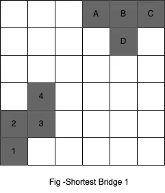
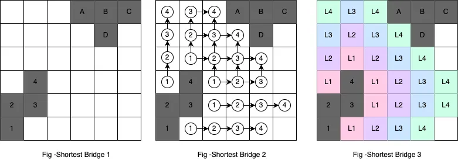

---
title: Shortest Bridge - Algorithm Analysis
author: Chiradip Mandal
description: Shortest Bridge - Algorithm Analysis.
order: 3
---
###### Chiradip Mandal | System Design School

### Problem Description

**Problem taken from LeetCode**

You are given an `n x n` binary matrix `grid` where `1` represents land and `0` represents water.

An island is a 4-directionally connected group of 1s that is not connected to any other 1s. There are exactly **two** islands in the grid.

You may change 0s to 1s to connect the two islands into one.

**Return the smallest number of 0s you must flip to connect the two islands.**

---

### Visual Analysis



In `fig - Shortest Bridge 1`, the dark-colored cells represent land (1s in the input matrix). As stated in the problem, we have exactly 2 islands. One set of land is marked numerically as 1, 2, 3, 4. The other is marked alphabetically as A, B, C, D.

---

### Initial Thoughts

If we find a single land cell (`1`), we can discover the entire island it belongs to using DFS, BFS, or Disjoint Set Union (Union-Find). Each is a standalone step in the overall algorithm and can be independently designed.

---


### DFS-Based Island Construction

We'll define a method:

- **Name**: `constructIslandOne`
- **Input**: 2D matrix `grid`
- **Output**: List of coordinate pairs forming the first island
- **Signature**: `constructIslandOne(grid : Int[][]) : List[Int[]]`

#### Algorithm (DFS)
```
-- The method takes the matrix (2-D array) called grid as input
-- Returns co-ordinates of one constellation of 1s, thats 2X (2-by) matrix.
constructIslandOne(grid : Int[][]) : List[Int[]]  is
   -- invariants number of rows and number of columns customer m & n
   m := length(grid)
   n := length(grid[0])
   -- to hold list of array of length 2
   coordList : List[Int[]]
   -- Scan the whole matrix/grid to find one 1
   -- iterate over the rows
   outer-loop:
       for (r -> 0 to m):
           -- Iterate over each column of row r
           for (c -> 0 to n):
               -- interest is where value at the cell is 1
               if (grid[r][c] EQUALS 1):
                   -- Do a depth first search
                   dfs(r, c, grid, coordList)
                   -- We don't want to accidentally explore the land mass in the
                   -- second island
                   break outer-loop
   -- Return coordList
   return coordList
              
   dfs(r : Int, c : Int, grid : Int[][], coordList : List[Int[]]) is
     -- Marking the cell as visited. Mutating the input, if that's not allowed
     -- use an auxiliary boolean matrix
     -- marked by -1 for making it distinct from cell with water
     grid[r][c] := -1
     -- Add this cell's coordinates to coordList
     coordList.add([r, c])
     -- invariants number of rows and number of columns customer m & n
     m := length(grid)
     n := length(grid[0])
     -- find all the adjacent cells of grid[r][c]
     -- DIRECTIONS Defined globally, here for reference.
     -- DIRECTIONS := (LEFT : = [0, -1], RIGHT := [0, 1], UP := [-1, 0],
     -- DOWN := [1, 0])
     for (dir in DIRECTIONS):
         r_prime := r + dir[0], c_prime := c + dir[1]
         -- check whether r_prime & c_prime  are within legal boundary of the grid
         if (0 ≤ r_prime < m && 0 ≤ c_prime < n):
             if (grid[r_prime][c_prime] EQUALS 1):
                 -- Do a depth first search
                 dfs(r_prime, c_prime, grid, coordList)     
```

##### Time Complexity Analysis of the above DFS.


Evidently, in the worst case scenario where the whole matrix is filled with 1s, we are visiting each cell exactly one time. So time complexity TC = O(MxN) where M is the number of rows in the grid and N is the number of columns. For this particular case O(N^2), since we have a NxN square matrix.


Deeper analysis: Visiting all the vertices of a graph G(V, E), is O(V + E). In this NxN grid case, V = N ^ 2 in the worst case scenario. And E is approximately 2 x N ^ 2. Why 2 x N ^ 2? If a matrix is considered as an undirected graph, every cell (vertex or node) will have 4 adjacent (except the cells at the 4 edges and 4 corners) connections. Since the graph is undirected, every connection will be also counted 2 times since E(i,j) = E(j,i).


Fresh take - TC = O(V + E) = O(N^2 + 2 x N ^ 2) = Asymptotically O(N ^ 2).


Space Complexity - O(log n ^ 2) = O(2 x log(n)) = asymptotically O(log(n)). Why log in this space complexity? Because the way we are handling this matrix, it behaves like a binary tree, every vertex has at most 2 unvisited adjacent cells, we are branching out 2 times (at most) at every cell.


O(log(n)), if you think space complexity is O(n ^ 2) as claimed in many places, please convince me about that.
### Breadth First Search
I am not going to do a ton of commentary about it, since it is similar to depth first search but the algorithm itself has sufficient commentary.

```
-- The method takes the matrix (2-D array) called grid as input
-- Returns co-ordinates of one constellation of 1s, that's 2X (2-by) matrix.
constructIslandOne(grid : Int[][]) : List[Int[]]  is
   -- invariants number of rows and number of columns customary m & n
   m := length(grid)
   n := length(grid[0])
   -- A FIFO queue of type Int[] to hold cells of the matrix
   queue := Queue[Int[]]
   -- to hold list of array of length 2
   coordList : List[Int[]]
   -- to accumulate all immediate adjacent cells and explore iteratively
   -- iterate over the rows
   outer-loop:
       for (r -> 0 to m):
           -- Iterate over each column of row r
           for (c -> 0 to n):
               -- interest is where value at the cell is 1
               if (grid[r][c] EQUALS 1):
                   -- marks the cell with -1
                   -- put the coordinates into the QUEUE
                   queue.add([r, c])
                   -- We need exactly only one cell coordinate
                   break outer-loop
                  
   while queue is NOT_EMPTY:
       polled := queue.poll()
       r := polled[0], c := polled[1]
       -- Add to the list coordList, it is part of the first island as 1 or land mass in the constellation of 1s
       coordList.add([r, c])
       -- Mark the cell with -1 so that we can distinguish that with water 0 and island on the other side which has 1s
       grid[r][c] := -1
       -- find all the adjacent cells of grid[r][c]
       -- DIRECTIONS Defined globally, here for reference.
       -- DIRECTIONS := (LEFT : = [0, -1], RIGHT := [0, 1], UP := [-1, 0],
       -- DOWN := [1, 0])
       for (dir in DIRECTIONS):
           r_prime := r + dir[0], c_prime := c + dir[1]
           -- check whether r_prime & c_prime  are within legal boundary of the grid
           if (0 ≤ r_prime < m && 0 ≤ c_prime < n):
               if (grid[r_prime][c_prime] EQUALS 1):
                   queue.add([r_prime, c_prime])
              
   -- Return the list with first constellation of 1s representing first island
   return coordList   
```

#### Time and Space complexity for BFS
In the worst case, the algorithm has to traverse all the cells that will take O(N^2) time asymptotically.


Space Complexity is the length of the queue which can be O(N). It is not O(n^2) as popularly believed. Because the maximum cells the queue will hold at any single point of time is the biggest circle that can be drawn inside the matrix. A circle's circumference is proportional to its radius.
#### One Island Constructed as a List


### Finding the shortest bridge
We identified one island already, we have to explore understanding, considerations, and options, and then we weigh in the option and choose the most optimum one.


- Understanding
   - We've identified one island as constellation of 1s.
   - We have potentially multiple vertices as source, part of island one
   - We have potentially multiple vertices at destination, part of the island 2 - we did  not identify yet
- Considerations
   - BFS exploration provides us the shortest path between two vertices on a graph
   - When first 1 in the island 2 is reached, the path traversed is shortest BUT
   - What is the source? We have potentially multiple 1s as part of island 1
   - Lets explore the above question in options section
- Options
   - Should we do multiple BFS one for each origin 1 in island 1 and then compare the length and find the shortest?
   - Or can we explore the next set of cells layer by layer?
- Weighing in
   - If we decide to do BFS exploration for each cell in island 1, we will run BFS exploration as many times as the number of 1s in island one. Potentially revisiting ALMOST all the vertices x times, where x is the number of 1s in island one. The real number of BFS explorations would be x * (n^2 - x), if x ≥ 1 and n ≥ x, then practically the time complexity is O(x * N ^ 2). We can do it better than this.
   - To consider using a layered approach lets first understand this with the following diagrams.





Pay attention to `Fig - Shortest Bridge 1`, draw a mental picture and think about how a bridge can be constructed between these 2 constellations of land-masses or 1s.


Let's now look at the diagram 2 `Fig - Shortest Bridge 2`, we are now the `circled 1s` are the first step that can be taken from the constructed island to the left. The second step `circled 2s` are the steps from `circled 1s` and `circled 3s` are next to `circled 2s` and so on.


We can clearly see a pattern emerging, we are making progress towards the technically unidentified island (we can see in the picture though for illustration purpose) layer by layer. Now let's look at the diagram `Fig - Shortest Bridge 3`, we can see the layers `L1, L2, L3 and L4`. They are color coded for enhanced clarity. In our illustration, layer 4 denoted as `L4` is touching the island to the right. So the distance `4` is the shortest.


Lets draw a mental picture of how the layers can be constructed and processed to get the next layer. That's the principal key to the main part of our `algorithm`.


Lets also consider the land masses, i.e. all the `1s` in island one to the left as the `layer 0`. Since we decided to use `BFS`, we can load the island 's `1s` into a `QUEUE`.


The following code snippet would get the island one as a list.

	islandOne : List[Int[]] := constructIslandOne(grid : Int[][])


Be careful now, we can put all the `1s` in the `QUEUE` and we discover their `adjacent 1s` and load them up into the `QUEUE` and iteratively process them. We will make layer by layer progress in this way. But here is the exercise of caution . In this way we can reach to the other island quickest, but we will not be able to count the number of layers without a demarcation in the `QUEUE`. One way to achieve this is to exhaust the `QUEUE` while constricting the next layer, when the `QUEUE` is exhausted, that means new layer is completely constructed, and we can add the newly constructed layer back to the `QUEUE`, every time we add a new layer to the `QUEUE`, we `count` the number of layers constructed by incrementing a `counter`. At one point, `QUEUE` would be exhausted and no new layer will be available to add, that's the time we stop. Again, BE CAREFUL, if the situation arises such that we exhausted the `QUEUE` and no new layer is constructed, that means we reached the end but could not find the promised island to construct a bridge to. BUT this situation must be addressed in the algorithm - i.e. what if there is not second island!

Let's work on the algorithm.
Anatomy of the sub-algorithm:


- Method Name: `shortestBridge`
- Input:
   - a matrix i.e. a two-dimensional array, name `grid`
   - a list of Integer, lets call is islandOne - consists of 1s in the island 1
- Returns: a count, the count of the constructed layers as discussed in the earlier section 
- Data Structures:
   - QUEUE[Int[]] - to hold the current coordinates being processed - global
   - List[Int[]] - the current layer being constructed from the QUEUE - local
- Signature: `cshortestBridge() : Int`

#### Main Algorithm: `shortestBridge`

- **Input**: `grid`, `islandOne`
- **Output**: shortest distance (layer count)
- **Signature**: `shortestBridge(grid: Int[][], islandOne: List[Int[]]) : Int`
```
shortestBridge(grid : Int[][], islandOne : List[Int[]]) : Int is
   -- queue to hold the current layer - the layer to be processed immediately
   queue := Queue[Int[]]
   -- Add the 1s from islandOne to the QUEUE
   for(cell in islandOne)
       queue.add(cell) -- adding the coordinates to the QUEUE
   -- the counter that keeps track of number of constructed and processed layers
   layerCount := 0
   mainloop:
       while (queue IS NOT_EMPTY):
           currentLayer := List[Int[]]
           while (queue IS NOT_EMPTY):
               cell := queue.poll()
               r := cell[0], c := cell[1]
               -- DIRECTIONS Defined globally, here for reference.
               -- DIRECTIONS := (LEFT : = [0, -1], RIGHT := [0, 1], UP := [-1, 0],
               -- DOWN := [1, 0])
               for (dir in DIRECTIONS):
                   r_prime := r + dir[0], c_prime := c + dir[1]
                   -- check whether r_prime & c_prime  are within legal boundary of the grid
                   if (0 ≤ r_prime < m && 0 ≤ c_prime < n):
                       if (grid[r_prime][c_prime] EQUALS 1):
                           -- Reached to the promised island the process can terminate
                           break mainloop
                       else if (grid[r_prime][c_prime] EQUALS 0): -- 0 value at a coordinate meaning water and bridge can be constructed over it
                           -- add coordinates to current layer
                           currentLayer.add([r_prime, c_prime]) 
                           -- mark the cell as visited with 2 
                           grid[r_prime][c_prime] := 2
                          
           -- at this point `queue` is empty - check the currentLayer
           if (currentLayer IS NOT_EMPTY):
               for(cell in currentLayer):
                   queue.add(cell) -- adding the coordinates to the QUEUE, `queue` is no longer empty
               layerCount := layerCount + 1    -- current layer is non empty and counted as one additional step
           else: -- this block can be inflated and be taken out of the if-else block but kept in this way for idiomatic correctness
               -- the promise is broken, no second island found
               -- we can through an exception or set the layerCount to INFINITY or maximum integer value
               layerCount := INFINITY
   -- layerCount is the distance between 2 islands
   return layerCount
```

### Overall Complexity Analysis
Time complexity TC = O(N^2) as previously discussed, the main algorithm has the same pattern of time complexity like the BFS/DFS for finding the first island.
Space Complexity = O(N) + O(log(N)) which can be simplified as O(N). Not O(N^2) - but I am open to having a debate if you strongly think it is O(N^2).


This concludes our algorithm analysis without a single line of coding but algorithmic programming. A high-quality translation of this into code is now art, since science is covered in the algorithm itself. Your homework would be to translate artistically into code using your favorite programming language(s).

